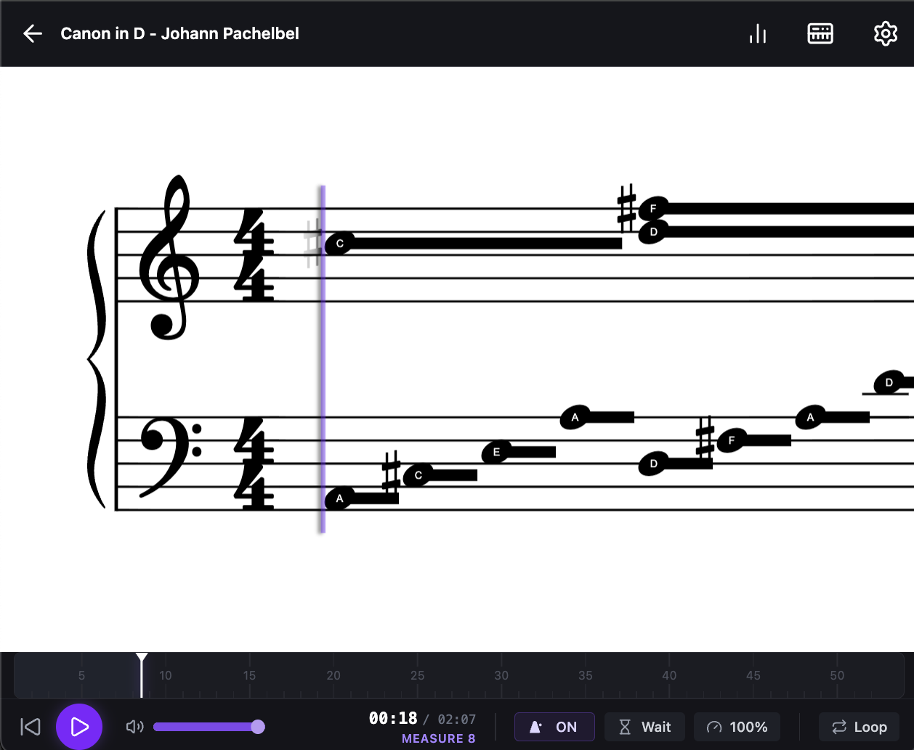

# [sightread](http://sightread.dev)

A free and open-source webapp for learning to play Piano. Play music without needing to learn sheet music. Plug in your MIDI keyboard for the optimal experience. See full details on the [website](https://sightread.dev/about).

Please read `CONTRIBUTING.md` if you'd like to contribute.
