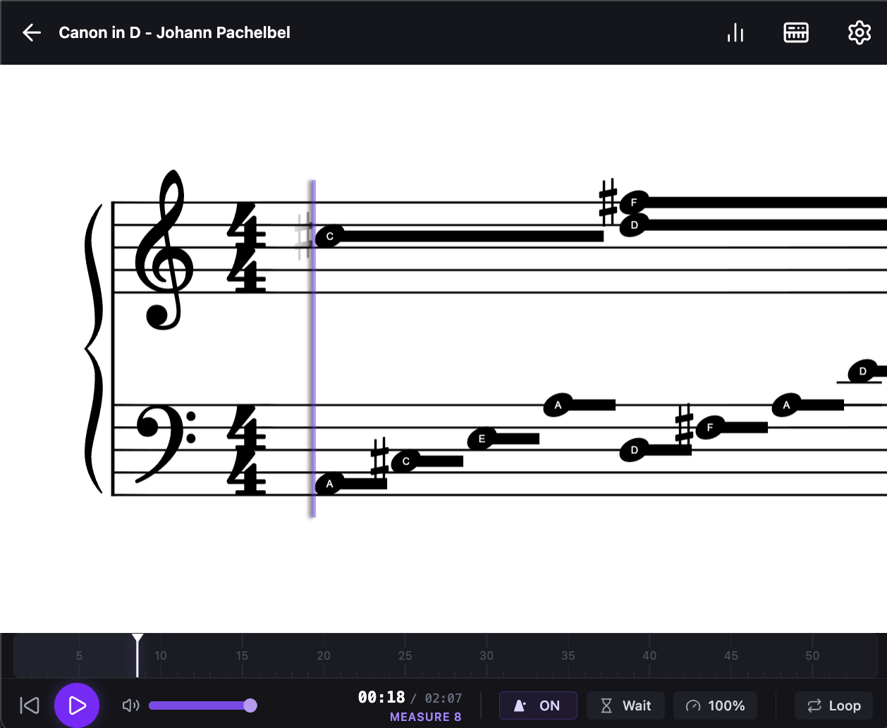

# [sightread](http://sightread.dev)

A free and open-source webapp for learning to play Piano. Play music without needing to learn sheet music. Plug in your MIDI keyboard for the optimal experience. See full details on the [website](https://sightread.dev/about).

## Project Status Update (March 2026)

Effective March 4, 2026, Sightread is transitioning to a **private development phase** while we iterate faster on product and sustainability. We are actively thinking about which parts of the project can stay open long-term, and will open source as much as possible in 2027.

Thank you for supporting the project and helping shape what comes next.

### What this means

- The code in this repository remains available under its current open-source license.
- The code and feature set in this snapshot will remain **free forever**.
- Pull requests are disabled. New development is happening in a private repository.
- We intend to open-source the core again in the future, and ideally as much of the full app as possible.
